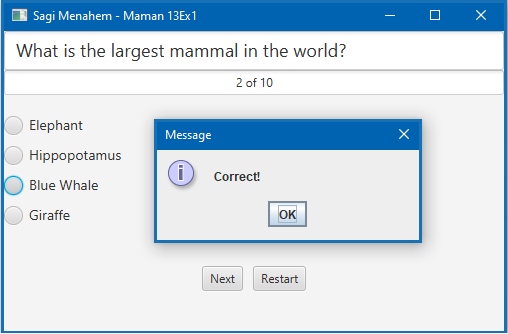

# American-Test

This project is a JavaFX implementation of a quiz application. It consists of a controller class, `Maman13Ex1Controller`, and utilizes JavaFX components such as RadioButtons and TextFields to create a simple quiz interface.

Task #3 for the 20554 java course of the Open University

## Quiz Questions

The quiz contains a set of questions, and users can select their answers using RadioButtons. The questions are initialized in the `initializingQuestions()` method and shuffled for a randomized quiz experience.

## Controller Class

The `Maman13Ex1Controller` class provides the following features:

### Features:

1. **Question Display:** Displays the current question along with answer choices using JavaFX TextFields and RadioButtons.

2. **Answer Validation:** Validates user-selected answers and provides feedback using JavaFX JOptionPane.

3. **Score Tracking:** Tracks the number of correct answers and displays the current score.

4. **Quiz Restart:** Allows users to restart the quiz from the beginning.

## Usage

To use this quiz application, follow these steps:

1. Run the application.
2. Answer each question by selecting the appropriate RadioButton.
3. Click the "Next" button to proceed to the next question.
4. After you answer all the questions, you will be presented with the result you received in the test.

## Screenshots

